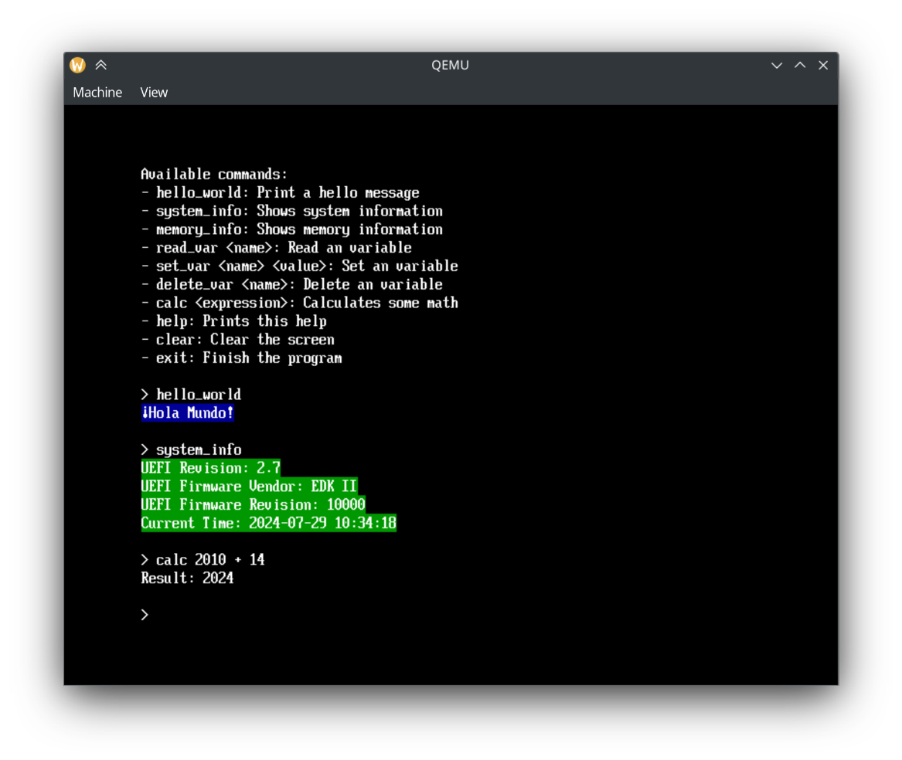

# helloworld-uefi



A basic UEFI application written in Rust.

## Requirements

- Rust (with the `x86_64-unknown-uefi` target)
- QEMU
- OVMF (for UEFI firmware)

## Building

To build the UEFI image, run:

```bash
cargo uefi-build
```

This will create a bootable image in the `target/out` directory.

## Running

To run the UEFI image, run:

```bash
cargo uefi-preview	
```

This will start a QEMU instance with the UEFI bootable image.

## Debugging

To debug the UEFI image, run:

```bash
cargo uefi-debug
```

This will start a QEMU instance with the UEFI image without building the image.